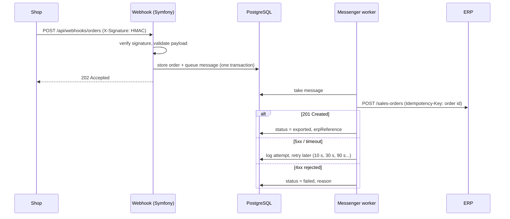

# ERP Order Bridge

[](https://github.com/cypriennkeneng/erp-order-bridge/actions/workflows/ci.yml)


A small Symfony service that receives orders from an online shop through a signed
webhook and pushes them to an ERP, reliably: exactly once, with retries when the
ERP is down, a clear failure state when it rejects data, and a full audit trail.

It is a **reference implementation** of a problem I solve regularly in client
projects (Shopware ↔ ERP integrations), written as a standalone Symfony app so
the patterns are easy to read. The ERP is simulated; everything else is built the
way I would build it for production.

## The problem

Connecting a shop to an ERP looks simple ("POST the order to the ERP API") until
real traffic hits it:

- The shop **retries webhooks** when it does not get a fast `2xx`, so the same
  order arrives several times.
- The ERP is **sometimes down** or slow, and the shop must not wait for it.
- The ERP **rejects some orders** (unknown article, invalid customer data), and
  someone has to see that and fix it.
- A retry after a timeout must not create a **second sales order** in the ERP.

## How it works



| Concern | Where | How |
|---|---|---|
| Authenticity | [`WebhookSignatureListener`](src/EventListener/WebhookSignatureListener.php) | HMAC-SHA256 over the raw body, constant-time comparison, checked **before** the payload is deserialized |
| Validation | [`IncomingOrder`](src/Dto/IncomingOrder.php) | `#[MapRequestPayload]` DTO + Validator; amounts in cents, total must equal the sum of lines |
| Idempotent intake | [`OrderIngestion`](src/Ingestion/OrderIngestion.php) | `(source, orderNumber)` unique key; same content → `200`, different content → `409`; race between two deliveries handled |
| No lost messages | [`OrderIngestion`](src/Ingestion/OrderIngestion.php) | order and queue message written in **one** database transaction (Doctrine transport) |
| Retries | [`messenger.yaml`](config/packages/messenger.yaml) | 5 retries, exponential backoff, then `failed` transport |
| Retry vs. give up | [`HttpErpClient`](src/Erp/HttpErpClient.php), [`ExportOrderToErpHandler`](src/MessageHandler/ExportOrderToErpHandler.php) | 5xx, 429, network errors → retry; other 4xx → mark failed, no retry |
| No duplicate ERP orders | [`HttpErpClient`](src/Erp/HttpErpClient.php) | `Idempotency-Key` header = order id; handler skips already exported orders |
| Visibility | [`OrderEvent`](src/Entity/OrderEvent.php), [`OrderController`](src/Controller/OrderController.php) | append-only history per order; read API behind a bearer token |
| Recovery | [`RequeueFailedOrdersCommand`](src/Command/RequeueFailedOrdersCommand.php) | `app:orders:requeue-failed` after fixing data in the ERP |

## Run it

Requirements: Docker, or PHP 8.3+ with Composer and a PostgreSQL database.

```bash
git clone https://github.com/cypriennkeneng/erp-order-bridge.git
cd erp-order-bridge
docker compose up --build -d
```

This starts PostgreSQL, runs the migrations, serves the API on
<http://localhost:8000> and starts a Messenger worker. In the `dev` environment the
ERP is a built-in fake ([`FakeErpController`](src/Controller/FakeErpController.php))
that fails 30 % of requests with `503`, so you can watch the retries.

Send a signed order the way a shop would:

```bash
docker compose exec app bin/send-order 10042
# HTTP/1.1 202 Accepted
# {"id":"0199...","source":"shopware","orderNumber":"10042","status":"received",...}

docker compose exec app bin/send-order 10042             # same order again -> 200, nothing new
docker compose exec app bin/send-order 10043 UNKNOWN-1   # rejected by the ERP -> failed
```

Follow the worker, then look at the result:

```bash
docker compose logs -f worker

curl -H 'Authorization: Bearer change-me-api-token' 'http://localhost:8000/api/orders?status=failed'
curl -H 'Authorization: Bearer change-me-api-token' http://localhost:8000/api/orders/<id>
```

The detail view contains the history, e.g. `received → export_attempted →
export_deferred → export_attempted → exported`.

Secrets in `.env` are placeholders for local use only; set real values through
environment variables or Symfony secrets.

## API

| Method | Path | Auth | Responses |
|---|---|---|---|
| `POST` | `/api/webhooks/orders` | `X-Signature: sha256=<hmac>` | `202` new, `200` duplicate, `401`, `409` conflict, `422` invalid |
| `GET` | `/api/orders?status=&limit=` | `Authorization: Bearer <API_TOKEN>` | `200` |
| `GET` | `/api/orders/{id}` | `Authorization: Bearer <API_TOKEN>` | `200`, `404` |

Webhook payload (amounts in cents):

```json
{
  "source": "shopware",
  "orderNumber": "10042",
  "currency": "EUR",
  "customer": { "email": "jane@example.com", "name": "Jane Doe" },
  "lines": [
    { "sku": "PAL-EUR-1", "name": "Euro pallet, new", "quantity": 2, "unitPrice": 1999 },
    { "sku": "PAL-IND-2", "name": "Industrial pallet", "quantity": 1, "unitPrice": 2550 }
  ],
  "totalGross": 6548
}
```

## Quality

```bash
composer check   # php-cs-fixer (dry run), PHPStan level max, PHPUnit
```

- **Unit tests**: signature verification, ERP mapping (money formatting without floats), HTTP client error classification with `MockHttpClient`.
- **Functional tests**: the webhook and read API through the kernel, including signature, validation, duplicate and conflict cases.
- **Integration tests**: the Messenger handler against a real database and a fake ERP client; the "retries exhausted" listener driven by Messenger's own retry decision; the requeue command.
- **CI** runs coding style, PHPStan, the test suite on PHP 8.3 and 8.4, and checks that the migrations match the Doctrine mapping on PostgreSQL.

## Design notes

- **Why not call the ERP inside the webhook request?** The shop's timeout would
  depend on the ERP's availability, and a slow ERP would trigger more webhook
  retries. Accept fast, process asynchronously.
- **Why only the order id in the message?** The handler always works on the
  current database state. A message delivered twice, or after a requeue, cannot
  push stale data.
- **Why a plain exception for "ERP unavailable"?** Messenger's
  `RecoverableMessageHandlingException` bypasses `max_retries` and would retry
  forever. Rethrowing the original exception keeps the bounded retry strategy.
- **Why `check_delayed_interval: 1000`?** On PostgreSQL the Doctrine transport
  wakes the worker via `LISTEN/NOTIFY` and, by default, looks for *delayed*
  messages only once a minute. Retries planned for 10 s actually ran after about
  65 s in the first end-to-end run; this option brings them back on schedule.
- **Why integers for money?** `19.99` cannot be represented exactly as a float.
  Amounts stay in cents until the ERP payload is built.
- **Why a presenter instead of serializing entities?** The API shape is
  explicit; a new Doctrine field cannot leak into responses by accident.

## Out of scope

Deliberately left out to keep the code focused: a real ERP adapter (the
`ErpClientInterface` is the seam for one), multi-tenant secrets per shop,
outgoing status updates back to the shop, and a UI.

## License

MIT
